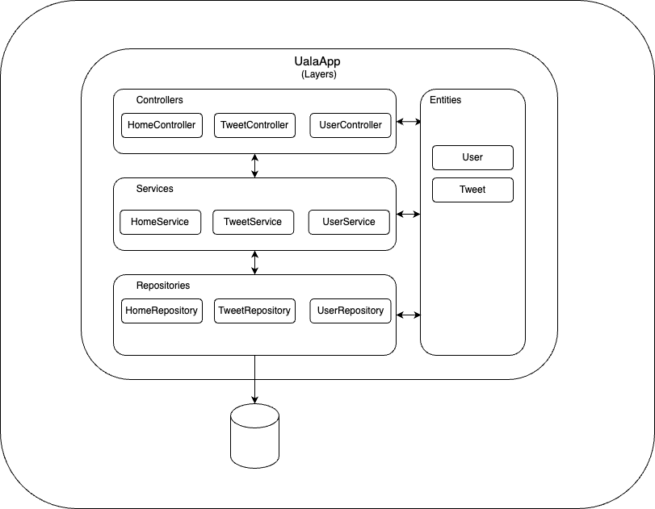
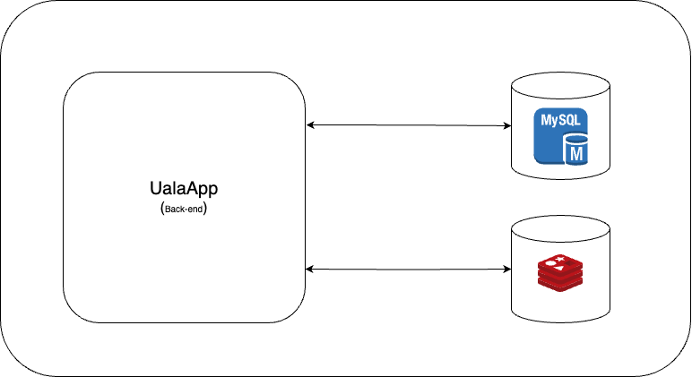

# Uala

## Ejercicio tecnico

[ChalengeBackend.pdf](Challenge%20Backend.pdf)

### Dependencias:

* [Docker](https://www.docker.com/)
* [Docker Compose](https://docs.docker.com/compose/)

### Para startear el proyecto :

```
una vez situado en la carpeta del proyecto 
correr desde terminal :

$ docker-compose up

```

# Arquitectura



# Infrastructura



### Consideraciones

```
Para todas las pegadas que necesiten un usuario 
este se enviara por request header userID

```

## [Assumptions](business.txt)

## [Postman Lib](postmanLib.json)

## [Swagger](http://localhost:8080/swagger-ui/index.html)
